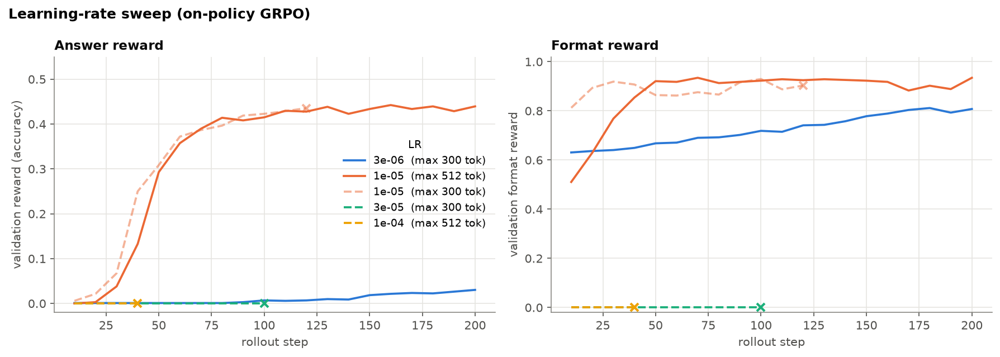
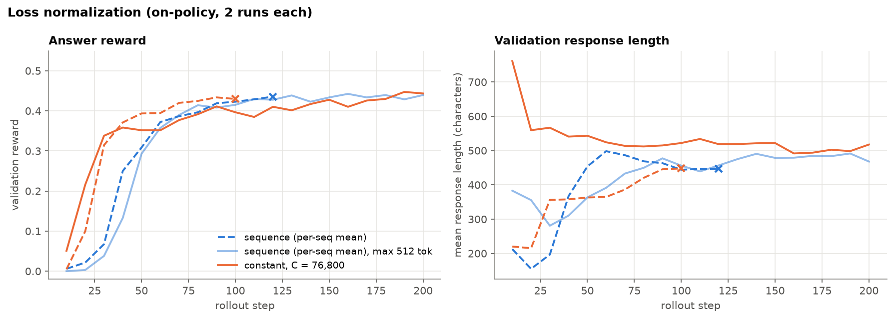
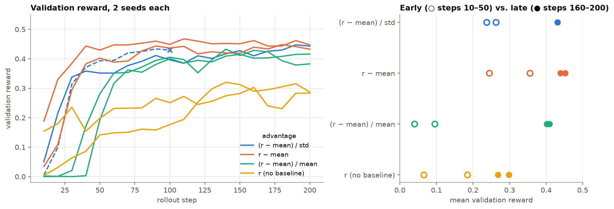
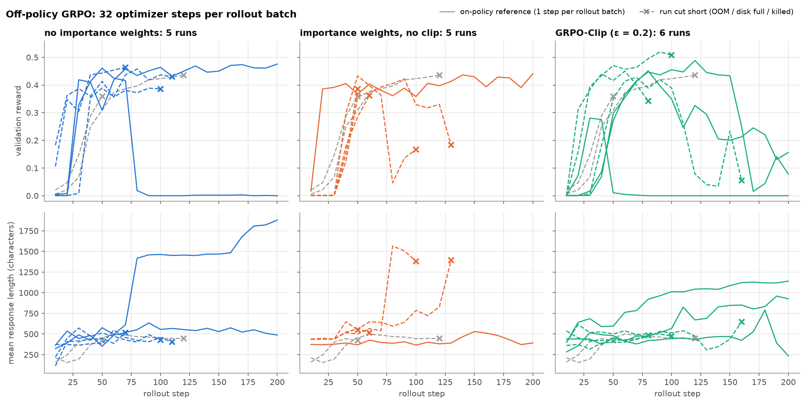

# CS336 Assignment 5: Alignment

RL post-trained `allenai/OLMo-2-0425-1B` on GSM8K ("grade school mathematical reasoning word problems"), using various 2x RTX 4090 setups I rented online via Vast.ai. I wrote all the code by hand, as required by the assignment. This document is >95% my own writing, though figures were generated by Claude.

I ran experiments on learning rate, loss normalization, advantage normalization, and off-policy training. The assignment handout is [cs336_spring2026_assignment5_alignment.pdf](./cs336_spring2026_assignment5_alignment.pdf).

TODO: Complete the instruction finetuning and RLHF supplement

## Setup

I found the following installation sequence to work for me:

```sh
uv sync
uv sync --extra plots
uv sync --extra gpu
```

## Implementation

| Component | File |
|---|---|
| Tokenization, response log-probs, rewards, group-normalized advantages, policy-gradient losses (no clip / GRPO-Clip / GSPO), loss aggregation, GRPO train step | [`cs336_alignment/rl_utils.py`](./cs336_alignment/rl_utils.py) |
| GRPO training loop (vLLM rollouts, eval, logging, checkpointing) | [`cs336_alignment/train_grpo.py`](./cs336_alignment/train_grpo.py) |
| Zero-shot baseline eval | [`cs336_alignment/baseline_eval.py`](./cs336_alignment/baseline_eval.py) |

### Training setup

| Parameter | Value |
|---|---|
| Model | OLMo-2-0425-1B |
| Prompt | `r1_zero` |
| Rollout steps | 200 |
| Rollouts per step | 256 (32 questions × group size 8) |
| Sampling | temperature 1.0, max 300 tokens |
| Optimizer | AdamW, LR 1e-5, β = (0.9, 0.95), no weight decay |
| Gradient clipping | 1.0 |
| Validation | 1,024 GSM8K test questions, every 10 steps |
| Hardware | 2× RTX 4090 (policy on GPU 0, vLLM on GPU 1) |

For on-policy RL, I used the above hyperparams. For off-policy, I used a train batch size of 8. For off-policy GRPO with clipping, I used cliprange = 0.2. I haven't run GSPO yet.

I ran into frequent CUDA memory issues because my GPUs were much smaller than the ones intended for the assignment, so I decided to use this opportunity to learn a bit about CUDA memory management. Some memory optimizations:
1. Increasing gradient accumulation steps from 32 to 64 (for on-policy)
2. Enabling expandable segments
3. Computing token entropy row-by-row
4. Reducing max tokens per sample from 512 to 300 -- this does change training trajectories, but for this particular dataset this is acceptable, since samples with >300 tokens are usually garbage
5. Diagnosing various memory leaks and unintended autograd graphs
6. Enabling gradient checkpointing (last resort since this slows down training considerably)

## Zero-shot baseline

Wrote eval script `baseline_eval.py`, which evaluates using three prompts: question only, basic reasoning prompt, and reasoning prompt + three-shot (see `./cs336_alignment/prompts`).

Question only (1 example shown; final result is average of 10):
```
question: While walking down the street with his 3 younger siblings, Greg found $20. To be fair to his siblings, he decided to split the money equally. How much money did each of them get?
rollout: Share on your favorite social media channel:💬-------------♏☞☠♂☞♒⛓💨👁💩👁💩👁💩👁💩👁💩💩💩💩💩💩💩💩💩💩
answer: 5

======================== FINAL RESULT ========================
reward: 0.0  format_reward: 0.2
==============================================================
```

Basic reasoning prompt:
```
question: While walking down the street with his 3 younger siblings, Greg found $20. To be fair to his siblings, he decided to split the money equally. How much money did each of them get?
rollout:  It would equate to $6 for each sibling, with Greg taking the remaining $4 for himself. </think> <answer>The teacher asked him to split the mode of transportation equally. My car is a Ford Mustang, which is the best car Greg owns, so he gives me my favorite car. </answer>
answer: 5

======================== FINAL RESULT ========================
reward: 0.0  format_reward: 0.7
==============================================================
```

Reasoning three-shot:
```
prompt: While walking down the street with his 3 younger siblings, Greg found $20. To be fair to his siblings, he decided to split the money equally. How much money did each of them get?
rollout:  Initially, Greg had $20. He decided to split it equally between his 3 siblings, so he gave each $20 / 3 = $6.67 (rounded to two decimal places). So each sibling had $6.67. </think> <answer> $6.67 each </answer>
answer: 5

======================== FINAL RESULT ========================
reward: 0.1  format_reward: 1.0
==============================================================
```

## Experiments

All plots are produced by [`notebooks/training_analysis.ipynb`](./notebooks/training_analysis.ipynb), which pulls run data from wandb.

### Learning-rate sweep



I tried a similar LR sweep as assignment 1, but RL is much more sensitive to LR. 1e-5 was actually the only successful LR. Runs with larger LR just started returning garbage (see "Sample rollouts" below).

I switched from sampling max tokens = 512 to 300 due to memory constraints. Everything after this section uses 300. (If I were being more rigorous, I should have checked the % of rollouts that were hitting the max, but given that mean response length remained significantly below the cap of ~1200 characters, I figured it wasn't worth it.)

### Loss normalization



GRPO traditionally normalizes loss by *sequence length*. We compare this with constant normalization using a factor of 76,800 = 256 (batch size) * 300 (max rollout length). Result: constant norm is better at first but worse long-term. This makes sense since constant norm upweights shorter rollouts, which are easier to train on.

### Advantage normalization



GRPO = (r-mean)/std. We also try some other methods:
1. Dr. GRPO = r-mean ("evenly weighted" policy gradient)
2. MaxRL = (r-mean)/mean (converges to max-likelihood estimator)
3. No baseline

The final results for GRPO, Dr. GRPO, and MaxRL are similar, though MaxRL starts slower (because it upweights low-reward prompts, which are harder). The no-baseline variant is much worse because it's too noisy. Runs have high variance, so ideally I should have run at least 4 trials per method, if not for compute limitations.

### Off-policy training



Off-policy RL is much more unstable for obvious reasons. There were unfortunately a lot of failed runs because of this instability, which drove up rollout lengths; in the end I had to turn on gradient checkpointing to be more conservative with memory.

It's not obvious which methods dominate here, though the clearest finding is that off-policy RL can result in significantly faster learning (sometimes), with the effect diminished a bit by importance weighting. This makes sense since importance weighting adds variance (while removing bias).

This might be too pessimistic of an example of off-policy RL, since 32 train steps per rollout is a LOT.

## Sample rollout

Here is a rollout from the best run (clipped off-policy GRPO before it failed)
```
sample prompt: A conversation between User and Assistant. The User asks a question, and the Assistant solves it. The Assistant first thinks about the reasoning process in the mind and then provides the User with the answer. The reasoning process is enclosed within <think> </think> and answer is enclosed within <answer> </answer> tags, respectively, i.e., <think> reasoning process here </think> <answer> answer here </answer>.
User: Katy participated in a summer reading program at her local library. She read 8 books in June, twice as many in July and three fewer in August than she did in July. How many books did Katy read during the summer?
Assistant: <think>
sample rollout:  Let's break it down. In June, Katy read 8 books. In July, she read twice as many as in June, which is 2 * 8 = 16 books. In August, she read three fewer books than in July, so that's 16 - 3 = 13 books. To find the total number of books she read over the summer, we add the books read in each month: 8 + 16 + 13 = 37 books. </think> <answer> 37 </answer>
```

Here is an example of a garbage rollout (produced by learning rate = 1e-4):

```
sample prompt: A conversation between User and Assistant. The User asks a question, and the Assistant solves it. The Assistant first thinks about the reasoning process in the mind and then provides the User with the answer. The reasoning process is enclosed within <think> </think> and answer is enclosed within <answer> </answer> tags, respectively, i.e., <think> reasoning process here </think> <answer> answer here </answer>.
User: Janet needs 5 tickets to ride the roller coaster and 3 tickets to ride the giant slide. How many tickets does she need to ride the roller coaster 7 times and the giant slide 4 times?
Assistant: <think>
sample rollout: price</think>price</think>price</think>price</think>price</think>price </think>price</think>price</think>price </think>price</think>price</think>price" </think>price"TeXKing</think>price</think>price</think>price</think>price</think>price</think>price" </think>price" </think>price</think>price</think>price</think>price</think>price" </think>price"TeXKing</think>price</think>price</think>price</think>price</think>price</think>price</think>price</think>price" </think>price" </think>price</think>price</think>price</think>price</think>price</think>price</think>price" </think>price" </think>price</think>price</think>price</think>price</think>price" </think>price" </think>price" </think>price" </think>price" </think>price" </think>price</think>price" </think>price</think>price</think>price" </think>price" </think>price" </think>price</think>price" </think>price</think>price</think>price" </think>price</think>price</think>price</think>price</think>price</think>price" </think>think> </think>think>think>think>think>think>think>think>think>think>think>think>think>think>think>think>think>think>think>think>think>think>think>think>think>think>think>think>think>think>think>think>think>think>think>think>think>think>think>think>think>think>think>think>think>think>think>think>think>think>think>think>think>think>think>think>think>think>think>think>think>think>think>think>think>think>think>think>think>think>think>think>think>think>think>think>think>think>think>think>think>think>think>think>think>think>think>think>think>think>think>think>think>think>think>think>think>think>think>
```

## Reproducing

```sh
# Unit tests
uv run pytest tests/test_grpo.py

# Zero-shot baseline
uv run python -m cs336_alignment.baseline_eval --n-examples 10

# GRPO (on-policy defaults)
uv run python -m cs336_alignment.train_grpo --train-data data/gsm8k/train.jsonl --val-data data/gsm8k/test.jsonl

# Off-policy GRPO-Clip (32 optimizer steps per rollout batch)
uv run python -m cs336_alignment.train_grpo --train-data data/gsm8k/train.jsonl --val-data data/gsm8k/test.jsonl --train-batch-size 8 --gradient-accumulation-steps 1 --importance-reweighting-method grpo --cliprange 0.2 --grad-checkpointing

# Plots
uv run --with jupyter --with matplotlib --with pandas jupyter lab notebooks/training_analysis.ipynb
```
